# CSE 232 : Assignment 1
## Command Line Utilities

Ans1. Command Used `ipconfig` 

a)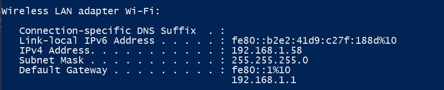

b) The IP address I see from `ipconfig` is my pc's local IP address. This is assigned by my router and is used for communication within my local network.

The IP address I see on "https://www.whatismyip.com" is my public IP address. This is the address my ISP assigned, and it's used for communication over the Internet.

---

Ans2. 

a) Command Used `nslookup -type=NS google.in`  
The above command is used to find the name servers for a domain google.in. 
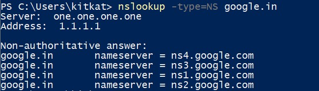

To find the IP address of a individual name server, we can use the command `nslookup google.in ns1.google.com`. This will give the ipv6 and ipv4 address of the name server ns1.google.com.
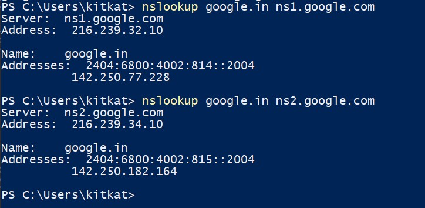

b) Command Used `nslookup -debug google.in`

- The debug mode of nslookup initially performs a reverse DNS lookup to identify the name associated with your DNS server's IP, which is why I  see a query for 1.1.1.1.in-addr.arpa and get a result of one.one.one.one.  
- For the domain "google.in", the IPv4 address is 142.250.194.164, and time to live is 259 seconds (4 minutes and 19 seconds) before my DNS server will refresh it.  
- The IPv6 address for "google.in" is 2404:6800:4002:823::2004, TTL of 300 seconds (5 minutes).

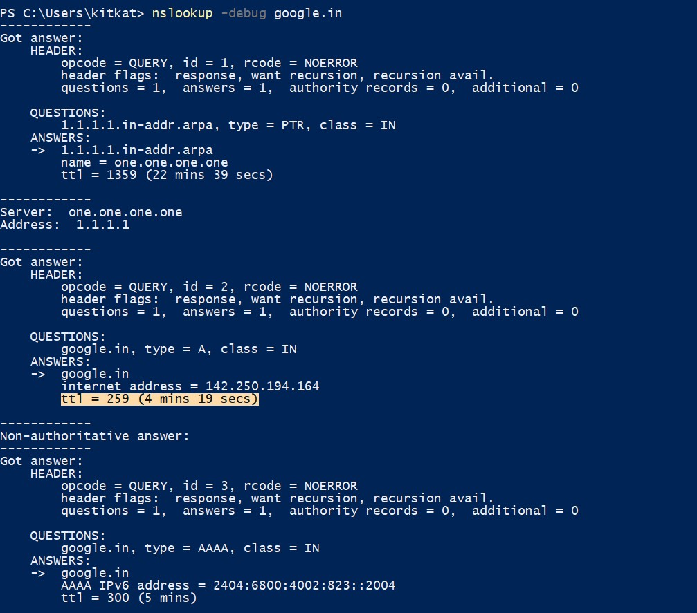

---

Ans03.   
a) Command used `tracert google.in`

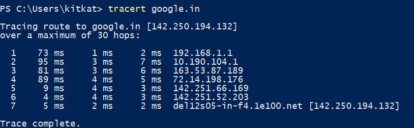

- I can see a total of 7 hops and the average latency to each intermediate host are 25.33, 35, 30, 32.67, 5.33, 3.67, 3 in milliseconds.

b) 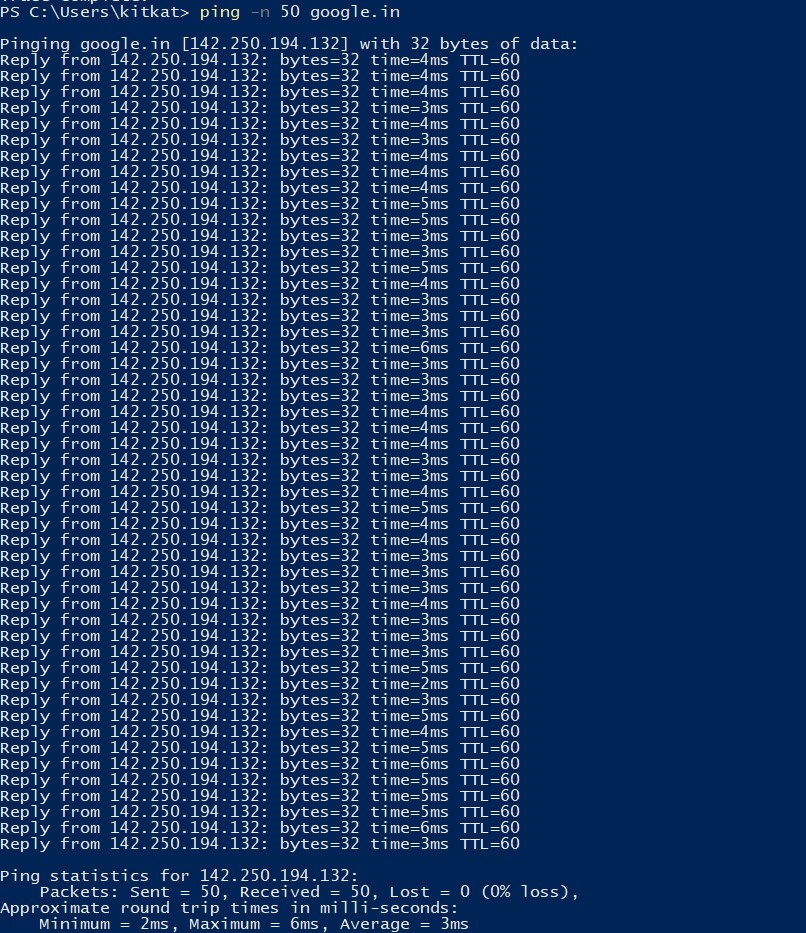
Average latency to google.in is 3 milliseconds.

c)  
Sum of Average Latencies: 25.33 ms + 35 ms + 30 ms + 32.67 ms + 5.33 ms + 3.67 ms + 3 ms = 135 ms  
From the ping results: 3ms
- No, The sum of the latencies from tracert is significantly higher than the average latency from ping. This is expected because ping measures the round-trip time (RTT) from my computer to the destination and back, while traceroute measures the time it takes to reach each intermediate host.

d)  
Maximum Latency: 35 ms (from Hop 2)  
From the ping results:
Average Latency: 3ms  
Not Matching.
- Although already explained in the above part, the ping and traceroute commands provide different insights into network performance. While ping gives an average round-trip time to a destination, traceroute provides a hop-by-hop breakdown of the path taken by packets.   

e) Multiple entries for a single hop in traceroute represent multiple probes sent to the same hop to get a more accurate measurement. Each probe might take a slightly different amount of time, so I see multiple latency values(three in this case).

f) 
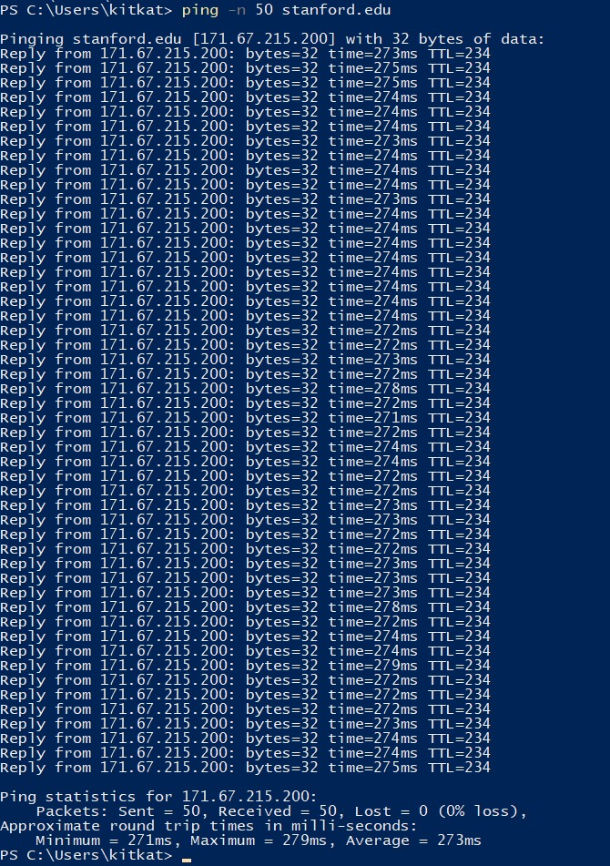
Average latency to stanford.edu is 273 milliseconds.

g)

  
- google.in has 7 hops.
- stanford.edu has 13 hops.
Thus, stanford.edu has more hops compared to google.in when traced from my location. The number of hops can vary based on the network path, the location of the servers, and the routing decisions made by intermediate networks. Some hops in stanford took longer than google.in. This might be because of the network path to stanford.edu is longer than the network path to google.in.

h)  
>google.in average Latency: 3ms  
>stanford.edu average Latency: 273ms

- Physical Distance: One of the primary factors affecting latency is the physical distance between the source and destination server. google.in likely directs me to a server that's geographically closer to me, possibly within India. In contrast, stanford.edu is located in California.

- Network Infrastructure: Google has a vast global network infrastructure with data centers around the world. They use advanced routing and content delivery techniques to ensure low latency and fast access for users. On the other hand, stanford.edu might not have the same level of global infrastructure as Google, leading to higher latencies.

- Number of Hops: As observed from the tracert results, stanford.edu has more intermediate hops compared to google.in. Each hop adds a slight delay, and the cumulative effect can increase the overall latency.

- Server Response Time: The responsiveness of the server itself can also impact latency. Google's servers are optimized for high performance and can handle a large number of requests efficiently. In contrast, specific servers at Stanford University might be under higher load or not as optimized, leading to slightly longer response times.

---

Ans04. ping command fail for 127.0.0.1 (with 100% packet loss)

- Achieving this in linux environment is pretty easy by adding an entry in iptables for localhost

- Achieving this in Windows is tricky. Adding firewall rules to block ping to 127.0.0.1 using protocol icmpv4 will not achieving our intended result.
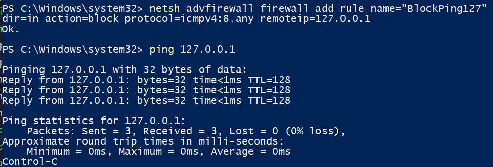

- We can block the inbound and outbound traffic for localhost using a freeware `clumsy` 
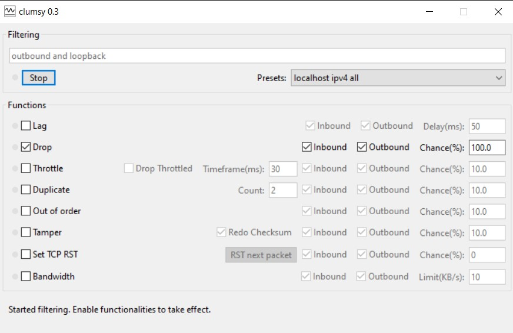

The final result will look like this:
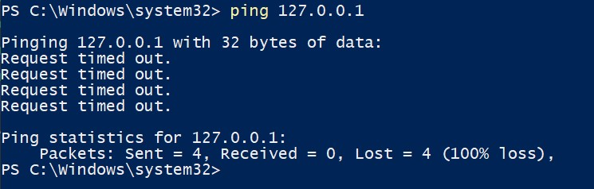

Source: [Answer on SuperUser by dakkaron](https://superuser.com/questions/1118881/how-do-you-disable-the-loopback-device-windows-10)

Clumsy: [Clumsy](https://github.com/jagt/clumsy)

---

Ans05
Command used:  
`telnet 192.168.24.12 9900`  
`GET /secret HTTP/1.1`
`Host: 192.168.24.12`

>secret key: U2FsdGVkX19+x/ug4M1wFYXRji8I6qmUgHOsKtqWGQAeiQ/Xy1Zmg5uKbUbOBO5P

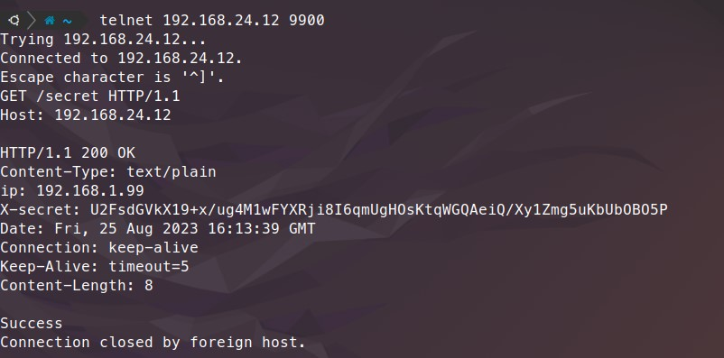  

--- 
Ans06  
Command used: `telnet 192.168.24.12 smtp`  

My Inputs:  
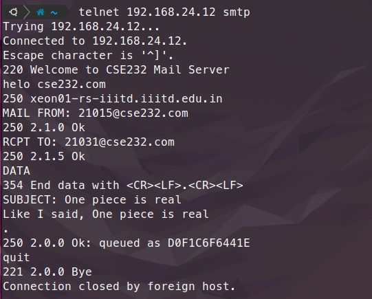

The email was sent successfully and the mail was received in my friend's inbox:  
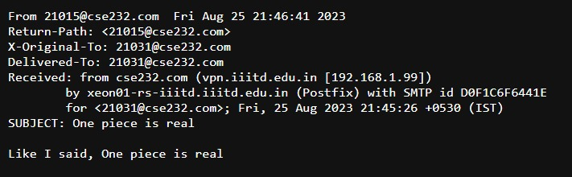

---

>Ankit Kumar, 2021015

