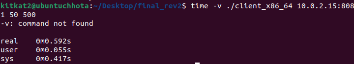

# Assinment 3: Analysis of synchronous and asynchronous TCP socket call APIs
Ankit Kumar 2021015, IIIT Delhi

## Setup Instructions: https://github.com/pnl-iiitd/CSE232-iiitd/tree/main/assignment3 

Graphs and htop results

Fork

500

1000

3000

Thread
500

1000

3000

Epoll\
500

1000

3000

Epoll 500 throughput

Epoll 1000 Throughput

Epoll 3000 throughput

Fork 500 throughput

Fork 1000

Fork 3000

Poll 500

Poll 1000

Poll 3000

Thread Throughput

500

Thread 1000

Thread 3000

SELECT THROUGHPUT
500

Select 1000

Fork-based servers:  
- Spawning of new process per connection escalates memory usage due to isolated resource allocation.  
- CPU overhead intensified by increased process count and higher context-switching frequency.  
 
pthread-based servers:  
- Threads within a single process share memory, reducing overall memory footprint compared to process-per-connection model.  
- High thread counts still strain CPU with scheduling overhead. Thread synchronization introduces significant resource overhead.

I/O Multiplexing (select, poll, epoll):
- Single process/thread manages multiple connections, leveraging
asynchronous polling of file descriptors, optimizing memory and CPU
usage.
- select and poll exhibit linear complexity, leading to         decreased efficiency as file descriptor count grows.
- epoll provides near-constant time complexity post-initialization, enhancing performance consistency.

Resource utilization factors:
- Management overhead for each process/thread and their associated data structures.

- CPU load correlates with context switch rates, system call overhead, and computation-intensive operations such as factorial calculations.

- Each bullet point reflects a more precise and technical language suited for an audience familiar with server architectures and performance considerations.