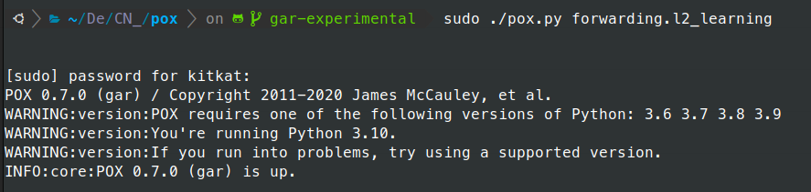

## Assignment 4:


### Toplology

### I'll recommend this article by Dr. Fraida Fund on TCP Congestion Control Basics: https://witestlab.poly.edu/blog/tcp-congestion-control-basics/





the graph gerenated is in the file: sender-ss.svg

When analyzing a plot of the congestion window (cwnd) size over time, there are specific patterns and behaviors I should looked for:
- TCP Doesn't Start from Scratch: Unlike slow start, TCP doesn’t reduce its cwnd to the initial size. Instead, it reduces the cwnd to half of the current window size (the size before packet loss was detected)
- Recovery Phase: TCP then enters a phase where it tries to inflate the window slowly as it receives ACKs for new data
- Exiting Fast Recovery: TCP exits fast recovery once all the lost packets are retransmitted and acknowledged. It then transitions to congestion avoidance, where the window grows more linearly

In my plot, if you see a pattern where the cwnd reduces drastically upon packet loss but then only halves and starts growing slowly, it's indicative of the fast recovery algorithm in action


Instead of python script i used the R script to analyse the csv

```
library(ggplot2)
dat <- read.csv("sender-ss.csv", header=FALSE)
names(dat) <- c("ts", "sender", "retr", "retr.total", "cwnd", "ssthresh")

senders <- data.frame(table(dat$sender))
sndlist <- senders[senders$Freq > 100,]$Var1

dat <- dat[dat$sender %in% sndlist,] 
dat$sender <- factor(dat$sender)

lost <- na.omit(dat[dat$retr>0,])

tsmin <- min(dat$ts)

q <- ggplot(dat) + geom_line(aes(x=ts-tsmin, y=cwnd, colour=as.factor(sender))) + geom_line(aes(x=ts-tsmin, y=ssthresh, colour=as.factor(sender)), linetype='twodash') 
q <- q + theme_bw() + facet_wrap(~sender, ncol=1, drop=T) + geom_vline(data=lost, aes(xintercept=ts-tsmin, colour=as.factor(sender)), alpha=0.1)
q <- q + scale_y_continuous("CWND") + scale_colour_discrete("Sender") + scale_x_continuous("Time (s)") + theme(legend.position="bottom")


svg("sender-ss.svg")
print(q)
dev.off()
```